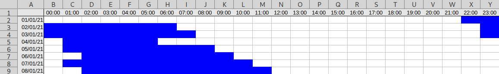

# Spreadsheet Graph Format

There is no formal definition for a spreadsheet graph, but people often independently create sleep diaries similar to the image above.  This format attempts to parse those graphs based on common features.

# In this directory

You may find the following useful:

* [JavaScript example code](engine.js)
* [Test cases](test.js)
* [Examples](examples/)

# Creation process

Spreadsheet graphs are usually created in [Microsoft Excel](https://www.microsoft.com/en-gb/microsoft-365/excel) or [LibreOffice Calc](https://www.libreoffice.org/discover/calc/).  The user adds a new row or column each day, and styles cells to indicate when they were asleep.

# Export format

The most common raw format for spreadsheets is [Office Open XML](https://en.wikipedia.org/wiki/Office_Open_XML), followed by [OpenDocument](https://en.wikipedia.org/wiki/OpenDocument).  These formats have been published as international standards, and will not be described here.

Spreadsheet graphs generally have the following properties:

* all relevant data is contained in the first (and usually only) sheet
* the spreadsheet contains the following sections:
  * column and row headers indicating dates and times (optional)
  * diary body
  * legend defining the meanings of different styles (optional)
* each header cell contains some form of timestamp (e.g. `2020-01-01` or `2am`)
* each body cell represents a unique time period, identified by combining the column and row times
* each cell's style in the diary body indicates the user's state during that time period
* legends consist of styled cells with explanatory text in the same cell or one nearby

The decoding process involves the following steps:

1. parse time values
2. calculate headers
3. detect the legend
4. convert data to sleep diary

The remainder of this section will discuss a simplified approach to solving these problems.  See [the JavaScript example code](engine.js) for a practical example.

## Parse time values

Spreadsheets represent both times and dates as an offset relative to some epoch, with no timezone information.  Users generally write dates in a format that spreadsheets automatically save as dates, but often write times using colloquial terms like "1am" or "noon".  Because times in the diary body are calculated by combining dates and times together, we need to extract date information for each cell:

1. if a cell contains a properly-formatted date or time:
   * round the value to the nearest minute
   * extract the number of years, months, days, hours and minutes specified by the date
2. if a cell contains a string that resembles a time (e.g. "1am" or "noon"):
   * calculate the number of hours and minutes specified by that date

## Calculate headers

Spreadsheet graphs often include times and dates in the first row or column.  If either are missing, we need to construct implicit headers based on other information.

To detect headers:

1. if either the first row or the first column contains a run of times:
  * treat that line as the time header if all the times are in the range `00:00`-`23:59`, or as a date header otherwise
2. otherwise, calculate the total number of columns and rows in the spreadsheet, modulo 24
  * treat the line with the lowest result as a time header
  * construct the line's implicit header as discussed below
3. treat the other line as the other type of header
  * if the other line does not contain a run of increasing times, construct an implicit header as discussed below

To construct an implicit time header:

1. calculate the number of cells in the line
2. remove cells from the right/bottom of the line until the number of cells is divisible by 24
3. assign a time of `00:00` to the first cell
4. continue through the cells, adding `24 / (number of cells in the line)` hours to each cell in turn

To construct an implicit date header:

1. calculate the number of cells in the line
2. remove cells from the right/bottom until the column/row has at least one styled cell
3. assign the current date to the final cell
4. continue backwards through the cells, removing one day from each cell in turn

## Detect the legend

Spreadsheet graphs sometimes contain a legend explaining what some or all styles mean.

To detect an explicit legend:

1. look for styled cells outside the header or body
2. look for cells containing text outside the header or body
3. while there are both styled cells and text cells remaining:
   1. find the styled cell and text cell with the lowest manhattan distance between them
   2. assign a meaning based on the pair of cells
   3. remove both of the cells from the lists

If the meaning of any body cells are not specified, we need to guess meanings from context:

1. count the number of cells in the diary body with each style, including unstyled cells
2. remove any cells that already have an assigned meaning
3. sort the remaining cells in decreasing order of frequency
4. if no style has been assigned the meaning `awake`:
   * assign the most frequent unassigned style the meaning `awake`, then remove that style from the list of unassigned styles
5. if no style has been assigned the meaning `asleep`:
   * assign the most frequent unassigned style the meaning `asleep`, then remove that style from the list of unassigned styles
6. assign arbitrary meanings to any remaining unassigned styles

## Convert data to sleep diary

Spreadsheet graphs must include a rectangular area containing the sleep diary itself.  This region is defined by the headers calculated in previous sections.  To calculate the sleep diary:

1. create a list of timestamps and associated meanings
2. for each cell in the body, create one item in the list:
   1. assign a time based on the cell's row and column
   2. assign a meaning based on the cell's style
3. sort the list in timestamp order
4. remove items where the meaning is equal to the previous meaning
4. for each remaining item, create a diary entry:
   1. set the diary entry's meaning to equal the value's meaning
   2. set the diary entry's start time to equal the value's time
   3. set the diary entry's end time to one minute before the next value's time
   4. for the final entry, leave the entry's end time unset

The above instructions should give you a set of diary entries with dates containing years, months, days, hours and minutes.  You may need to decide on a timezone in order to interpret these values (e.g. by using the system's timezone or asking the user).
